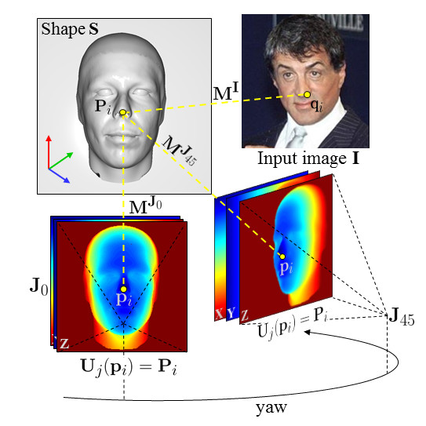
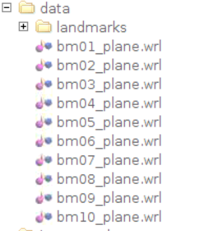

Precomputing 3D views for Face Rendering
===========

This page contains the MATLAB code to precompute offline the 3D views used in the rendering of  _I. Masi,T. Hassner, A. Tran, G. Medioni, "[Rapid Synthesis of Massive Face Sets for Improved Face Recognition](https://ieeexplore.ieee.org/abstract/document/7961797/) ", in Proc. of FG 2017_.

This release is part of a face recognition project. Please, check [this project page](http://www.openu.ac.il/home/hassner/projects/augmented_faces/) for updates and more data.



The 3D rendered views are created beforehand in MATLAB with the script `precompute_views.m`. This allows having precomputed view to render tilt variations as well or more angles.
The script will produce `.mat` files in the `models10_new` that can be used in the rendering by changing the logic of the code in order to use them. All the necessary information will be inside the `.mat` file. The main entity in the matlab file is the **U** matrix visualized in the figure above plus other necessary informations.

The MATLAB script to generate the 3D rendered views uses MATLAB + [this CG renderer](https://www.openu.ac.il/home/hassner/projects/poses/).

## Dependencies

* [MATLAB](http://matlab.com/)
* [OpenSceneGraph CG renderer MATLAB Wrapper](https://www.openu.ac.il/home/hassner/projects/poses//)

## Data requirements
1. If you have a 3D face model and you want to precompute the views from it, you can try on your own but you may need to modify this script. If you are looking for 3D models you can try [here](https://www.turbosquid.com/3d-model/head?synonym=human+head&sort_column=a5&sort_order=asc)
2. Another option is to use my code bundled with the 3D generic models along with the added planes to simulate the background. **In order to get these models, it is mandatory to check the following steps.**

In order to get the 3D models we used, you need first to download the BFM dataset here
- **[Download the Basel Face Model and accept their agreement](http://faces.cs.unibas.ch/bfm/main.php?nav=1-2&id=downloads)**
- *Once you signed their agreement*, you can get a copy of the models by sending an email to [iacopoma@usc.edu](mailto:iacopoma@usc.edu) and I will share the 3D models with you.
- Place the 3D models `wrl` files directly into the data folder as follows:



You also have to make sure that [OpenSceneGraph CG renderer MATLAB Wrapper](https://www.openu.ac.il/home/hassner/projects/poses//) is fully working.

To do that simply place the `local` folder downloaded from [OpenSceneGraph CG renderer MATLAB Wrapper](https://www.openu.ac.il/home/hassner/projects/poses//) and use the following bash script to run matlab so that it preloads all the required libraries, by modifiying your local paths:
```
#/bin/sh
LIBS_PREFIX=/home/iac/Code/face_specific_augm/render_mat_demo/local/
env LD_LIBRARY_PATH=$LIBS_PREFIX/Mesa-7.0.3/lib64/:$LIBS_PREFIX/lib64/osgPlugins-2.8.1/:$LIBS_PREFIX/lib64:$LIBS_PREFIX/lib /usr/local/MATLAB/R2013b/bin/matlab -desktop
```

Before running the code, please, make sure to have all the required data in the following specific folder.

**Please, refrain to open a ticket just to report that MATLAB cannot load OpenSceneGraph renderer etc.**

The code will generate the views for these angles `yaws = [0, -22, -40, -55 , -70, -75 ];` but you can add other values or other directions.


## Citation

Please cite our paper with the following bibtex if you use our face renderer:

``` latex
@inproceedings{masi2017rapid,
  title={Rapid synthesis of massive face sets for improved face recognition},
  author={Masi, Iacopo and Hassner, Tal and Tran, Anh Tu{\^a}n and Medioni, G{\'e}rard},
  booktitle={Automatic Face \& Gesture Recognition (FG 2017), 2017 12th IEEE International Conference on},
  pages={604--611},
  year={2017},
  organization={IEEE}
}
```

## References

[1] I. Masi\*, A. Tran\*, T. Hassner\*, J. Leksut, G. Medioni, "Do We Really Need to Collect Million of Faces for Effective Face Recognition? ", ECCV 2016, 
    \* denotes equal authorship

[2] I. Masi, S. Rawls, G. Medioni, P. Natarajan "Pose-Aware Face Recognition in the Wild", CVPR 2016

[3] T. Hassner, S. Harel, E. Paz and R. Enbar "Effective Face Frontalization in Unconstrained Images", CVPR 2015

[4] Brendan F. Klare, Ben Klein, Emma Taborsky, Austin Blanton, Jordan Cheney, Kristen Allen, Patrick Grother, Alan Mah, Anil K. Jain, "Pushing the Frontiers of Unconstrained Face Detection and Recognition: IARPA Janus Benchmark A", CVPR 2015

[5] F. Chan, A. Tran, T. Hassner, I. Masi, R. Nevatia, G. Medioni, "FacePoseNet: Making a Case for Landmark-Free Face Alignment," ICCV Workshop, 2017

## Changelog
- August 2018, First Release 

## Disclaimer

_The SOFTWARE PACKAGE provided in this page is provided "as is", without any guarantee made as to its suitability or fitness for any particular use. It may contain bugs, so use of this tool is at your own risk. We take no responsibility for any damage of any sort that may unintentionally be caused through its use._

## Contacts

If you have any questions, drop an email to _iacopoma@usc.edu_ or leave a message below with GitHub (log-in is needed).
